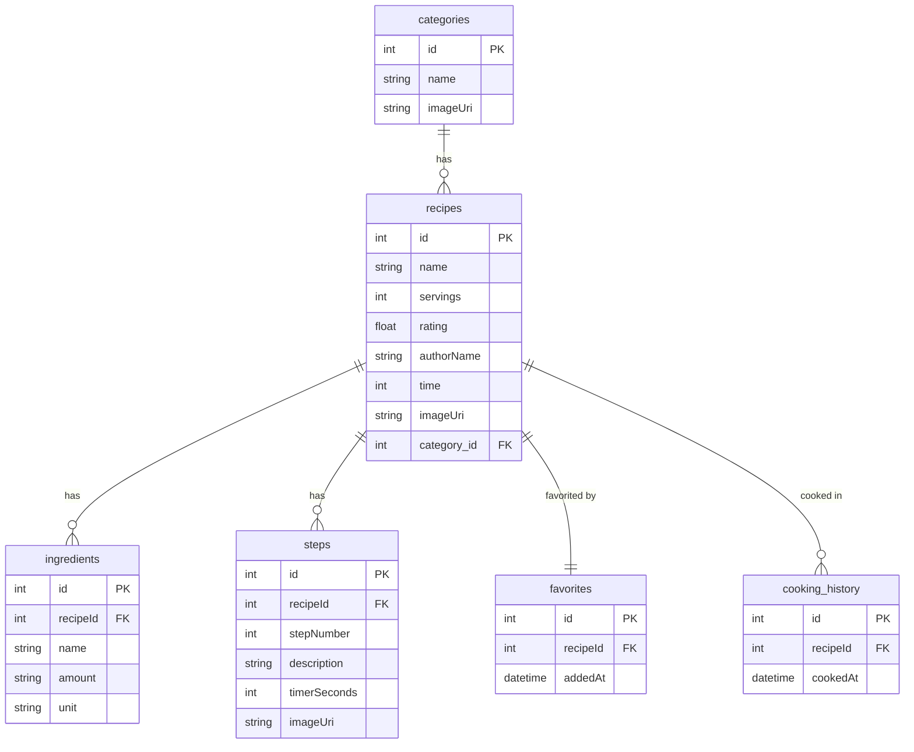

# Schemat bazy danych

1. `categories`:

- `id` - pk
- `name`
- `imageUri`

2. `recipes`:

- `id` - pk
- `name`
- `servings`
- `rating`
- `authorName`
- `time`
- `imageUri`
- `category_id`

3. `ingredients`:

- `id` - pk
- `recipeId` - fk → `recipes`
- `name`
- `amount`
- `unit`

4. `steps`:

- `id` - pk
- `recipeId` - fk → `recipes`
- `stepNumber`
- `description`
- `timerSeconds?`
- `imageUri?`

Rola: Kroki przygotowania (1:N)

5. `favorites`:

- `id` - pk
- `recipeId` - fk unique → `recipes`
- `addedAt`

Rola: Polubione (1:1 do `recipes`)

6. `cooking_history`:

- `id` - pk
- `recipeId` - fk → `recipes`
- `cookedAt`

Rola: Historia gotowania (1:N)
